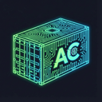

<p align="center">
  
</p>

<h1 align="center">Agent Containers</h1>

<p align="center">
  A web application for spawning and managing Docker containers and virtual machines, designed for isolated agentic coding environments.
</p>

<p align="center">
  <a href="#features">Features</a> •
  <a href="#getting-started">Getting Started</a> •
  <a href="#usage">Usage</a> •
  <a href="#architecture">Architecture</a>
</p>


## Features

### Docker Containers
- **Container Management**: Create, start, stop, and remove Docker containers with a clean web UI
- **SSH Access**: Optional SSH support with auto-generated keypairs (requires SSH server in your Dockerfile)
- **Docker Exec**: Quick terminal access via `docker exec` commands, copyable from the UI
- **Persistent Volumes**: Create and attach volumes for persistent storage across containers
- **Port Forwarding**: Expose container ports to the host for web services, APIs, etc.
- **Dockerfile Editor**: Create and manage custom Dockerfiles with a Monaco editor
- **Image Management**: Build custom images, pull from registries, and manage your image library
- **Compose**: Visual composer for multi-container setups

### Virtual Machines (cloud-hypervisor)
- **VM Management**: Create, start, stop, and remove virtual machines using cloud-hypervisor
- **SSH Access**: Auto-generated SSH keys with direct VM access via TAP networking
- **Resource Configuration**: Configure vCPUs (1-32), memory (512MB-64GB), and disk (1-1000GB)
- **QCOW2 Overlays**: Fast VM creation using copy-on-write disk images
- **Cloud-init Integration**: Automatic VM configuration with SSH keys and package installation
- **Network Bridge**: Pre-configured TAP devices for VM networking with DHCP

### Shared Features
- **MCP Servers**: Registry of Model Context Protocol servers for AI agent integration
- **OpenCode Pre-installed**: Default containers come with [OpenCode](https://opencode.ai) for AI-assisted development

## Getting Started

### Prerequisites

- Node.js 18+
- pnpm
- Docker

#### For Virtual Machines (Optional)
- Linux host with KVM support (`/dev/kvm` must exist)
- Root access (for initial network setup)
- All other dependencies are installed automatically by the setup script

### Installation

```bash
# Clone the repository
git clone https://github.com/launchable-dev/agentcontainers-community.git
cd agentcontainers-community

# Install dependencies
pnpm install

# Start development servers (backend + frontend)
pnpm dev
```

The server will start on port 4001 and the web UI on port 5173.

Open [http://localhost:5173](http://localhost:5173) in your browser.

### VM Setup (Optional)

To use virtual machines, run the setup script which handles everything automatically:

```bash
# Run the VM setup script (requires sudo)
sudo ./scripts/setup-vm-network.sh
```

This script automatically:
- Installs cloud-hypervisor binary
- Installs required tools (qemu-img, genisoimage, libguestfs-tools)
- Downloads Ubuntu 24.04 cloud image (~600MB)
- Extracts kernel and initrd for direct boot
- Creates a network bridge (`agentc-br0`)
- Creates 16 pre-allocated TAP devices for VMs
- Configures DHCP server (dnsmasq) for guest IP assignment
- Sets up NAT rules for internet access
- Creates systemd service for auto-restore on reboot

**Options:**
```bash
sudo ./scripts/setup-vm-network.sh --help           # Show all options
sudo ./scripts/setup-vm-network.sh --skip-image     # Skip base image download
sudo ./scripts/setup-vm-network.sh --skip-network   # Skip network setup
```

**Files created:**
```
~/.local/share/agentcontainers/
├── base-images/ubuntu-24.04/
│   ├── image.qcow2    # Base disk image
│   ├── kernel         # Extracted kernel
│   └── initrd         # Extracted initrd
├── vms/               # VM runtime data
├── ssh-keys/          # SSH keys
└── network.json       # Network configuration
```

## Usage

### Creating Your First Container

1. Click **+ New Container**
2. Enter a name for your container
3. Select a base image (default includes OpenCode)
4. Optionally attach a volume for persistent storage
5. Optionally configure port forwarding
6. Click **Create**

### Connecting to a Container

**Option 1: Docker Exec (Quick)**
- Copy the `docker exec` command from the container card
- Paste into your terminal

**Option 2: SSH (if enabled in your Dockerfile)**
1. Click the **SSH** button on the container card
2. Download the generated `.pem` key file
3. Use the provided SSH command:

```bash
ssh -i ~/.ssh/container-name.pem -p 2222 dev@localhost
```

*Note: SSH requires an SSH server to be installed and running in your container image. The default Dockerfiles include SSH support.*

### Working with Volumes

Volumes persist data across container restarts and rebuilds. Common uses:
- Store your project code
- Keep configuration files
- Preserve development databases

### Custom Dockerfiles

1. Go to the **Dockerfiles** tab
2. Create a new Dockerfile or edit an existing one
3. Build an image from your Dockerfile
4. Use the image when creating new containers

### Creating Your First VM

1. Ensure VM networking is set up (see [VM Network Setup](#vm-network-setup-optional))
2. Click the **VMs** tab in the sidebar
3. Click **+ New VM**
4. Enter a name for your VM
5. Select a base image (e.g., ubuntu-24.04)
6. Configure resources (vCPUs, memory, disk size)
7. Click **Create**

### Connecting to a VM

1. Click the **SSH** button on the VM card
2. Download the generated `.pem` key file
3. Use the provided SSH command:

```bash
ssh -i ~/.ssh/vm-name.pem -p 10022 ubuntu@localhost
```

*Note: VM SSH uses forwarded ports in the 10022-10122 range. The actual port is shown on the VM card.*

## Architecture

- **Backend**: Node.js with Hono framework, dockerode for Docker API
- **Frontend**: React 19 + Vite + Tailwind CSS v4 + TanStack Query
- **Monorepo**: pnpm workspaces

### Project Structure

```
├── packages/
│   ├── server/          # Hono backend API
│   │   ├── src/
│   │   │   ├── routes/  # API endpoints (containers, vms, images, etc.)
│   │   │   ├── services/ # Docker, hypervisor & container logic
│   │   │   └── types/   # TypeScript types & Zod schemas
│   │   └── templates/   # Dockerfile templates
│   └── web/             # React frontend
│       └── src/
│           ├── api/     # API client
│           ├── components/
│           └── hooks/   # TanStack Query hooks
├── scripts/             # Setup scripts
│   └── setup-vm-network.sh  # VM networking setup
├── assets/              # Logo and branding
├── data/                # Runtime data (gitignored)
│   ├── ssh-keys/        # Generated SSH keypairs
│   ├── dockerfiles/     # User-created Dockerfiles
│   ├── volumes/         # Container volume data
│   └── config.json      # User configuration
└── package.json
```

### VM Data Storage

VM data is stored separately from container data:

```
~/.local/share/agentcontainers/
├── vms/                 # VM runtime data
│   └── <vm-id>/
│       ├── disk.qcow2   # VM disk overlay
│       ├── cloud-init.iso
│       ├── vm.pid       # cloud-hypervisor PID
│       └── vm.log       # VM console log
├── base-images/         # Base VM images
│   └── ubuntu-24.04/
│       ├── image.qcow2
│       ├── kernel
│       └── initrd
└── ssh-keys/            # SSH keys (shared with containers)
```

## API Reference

### Containers
| Method | Endpoint | Description |
|--------|----------|-------------|
| GET | `/api/containers` | List all containers |
| POST | `/api/containers` | Create a new container |
| GET | `/api/containers/:id` | Get container details |
| POST | `/api/containers/:id/start` | Start a container |
| POST | `/api/containers/:id/stop` | Stop a container |
| DELETE | `/api/containers/:id` | Remove a container |
| GET | `/api/containers/:id/ssh-key` | Download SSH private key |

### Volumes
| Method | Endpoint | Description |
|--------|----------|-------------|
| GET | `/api/volumes` | List all volumes |
| POST | `/api/volumes` | Create a new volume |
| DELETE | `/api/volumes/:name` | Remove a volume |

### Images
| Method | Endpoint | Description |
|--------|----------|-------------|
| GET | `/api/images` | List all images |
| POST | `/api/images/pull` | Pull an image from registry |
| POST | `/api/images/build` | Build image from Dockerfile |
| DELETE | `/api/images/:id` | Remove an image |

### Virtual Machines
| Method | Endpoint | Description |
|--------|----------|-------------|
| GET | `/api/vms` | List all VMs |
| POST | `/api/vms` | Create a new VM |
| GET | `/api/vms/:id` | Get VM details |
| POST | `/api/vms/:id/start` | Start a VM |
| POST | `/api/vms/:id/stop` | Stop a VM |
| DELETE | `/api/vms/:id` | Delete a VM |
| GET | `/api/vms/:id/ssh` | Get SSH connection info |
| GET | `/api/vms/:id/logs` | Get VM logs |
| GET | `/api/vms/network` | Get network status |
| GET | `/api/vms/base-images` | List available base images |

### System
| Method | Endpoint | Description |
|--------|----------|-------------|
| GET | `/api/health` | Health check & Docker status |
| GET | `/api/config` | Get current configuration |

## Contributing

Contributions are welcome! Please feel free to submit a Pull Request.

## License

MIT
