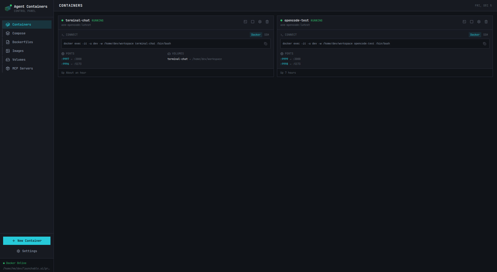

# Agent Containers

A web application for spawning and managing Docker containers, designed for isolated agentic coding environments.



## Features

- **Container Management**: Create, start, stop, and remove Docker containers
- **SSH Access**: Each container runs an SSH server with auto-generated keypairs for secure access
- **Persistent Volumes**: Create and attach Docker volumes for persistent storage across containers
- **Dockerfile Editor**: Create and manage custom Dockerfiles with a Monaco editor
- **Base Images**: Quick container creation from common Ubuntu/Debian base images

## Architecture

- **Backend**: Node.js with Hono framework, dockerode for Docker API
- **Frontend**: React 19 + Vite + Tailwind CSS v4 + TanStack Query
- **Monorepo**: pnpm workspaces

## Prerequisites

- Node.js 18+
- pnpm
- Docker

## Getting Started

```bash
# Install dependencies
pnpm install

# Start development servers (backend + frontend)
pnpm dev
```

The server will start on an available port (default 4001) and the web UI on port 5173.

## Usage

1. **Create a Volume** (optional): Create a persistent volume for your workspace
2. **Create a Container**: Select a base image and optionally attach volumes
3. **Download SSH Key**: Download the generated `.pem` file
4. **Connect**: Use the provided SSH command to connect to your container

```bash
# Example SSH connection
ssh -i ~/.ssh/container-name.pem -p 2222 root@localhost
```

## Project Structure

```
├── packages/
│   ├── server/          # Hono backend API
│   │   ├── src/
│   │   │   ├── routes/  # API endpoints
│   │   │   ├── services/ # Docker & container logic
│   │   │   └── types/   # TypeScript types & Zod schemas
│   │   └── templates/   # Dockerfile templates
│   └── web/             # React frontend
│       └── src/
│           ├── api/     # API client
│           ├── components/
│           └── hooks/   # TanStack Query hooks
├── data/                # Runtime data (gitignored)
│   ├── ssh-keys/        # Generated SSH keypairs
│   ├── dockerfiles/     # User-created Dockerfiles
│   └── config.json      # User configuration
└── package.json
```

## API Endpoints

- `GET /api/health` - Health check
- `GET /api/containers` - List containers
- `POST /api/containers` - Create container
- `POST /api/containers/:id/start` - Start container
- `POST /api/containers/:id/stop` - Stop container
- `DELETE /api/containers/:id` - Remove container
- `GET /api/containers/:id/ssh-key` - Download SSH key
- `GET /api/volumes` - List volumes
- `POST /api/volumes` - Create volume
- `DELETE /api/volumes/:name` - Remove volume
- `GET /api/images` - List images
- `POST /api/images/pull` - Pull image

## License

MIT
